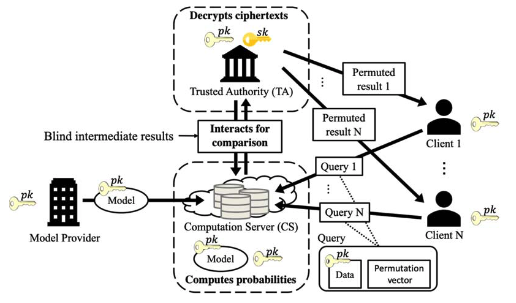
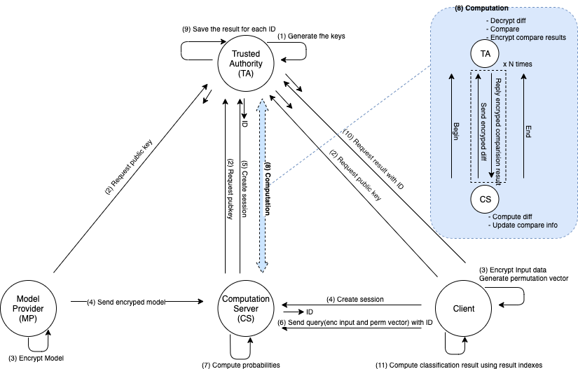
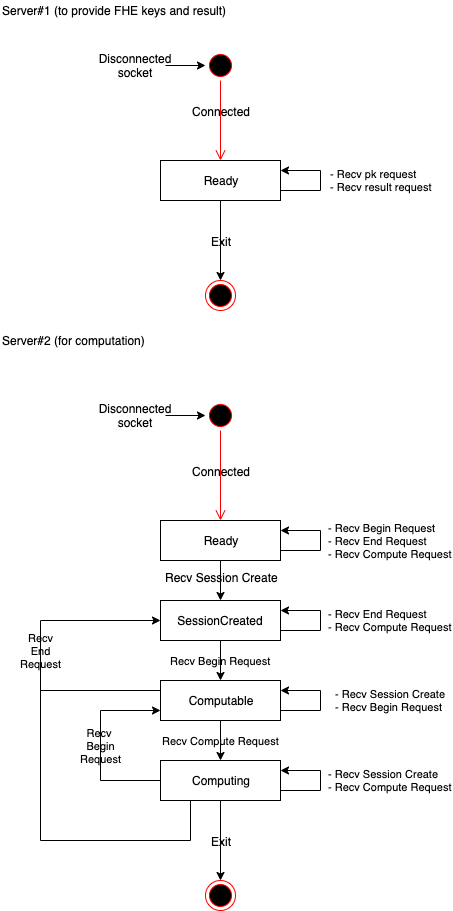
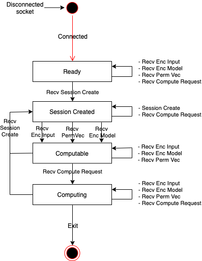

# NB-Classify
NB-Classify library enables outsourcing of data classification tasks to a cloud server without decryption of data by using FHE to allow secure computation.
The library also provides a program for training your classification model and writing it out to the required format for the program.



# Prerequisites
* Ubuntu LTS 16.04
* glibc 2.23
* g++ 5.4.0
* cmake 3.5
* [HElib v1.0.0](https://github.com/homenc/HElib/tree/v1.0.0)
* doxygen (to generate documentation)
* xterm (to run demo app using `demo.sh`)

# How to build
1. Build and install [HElib](https://github.com/homenc/HElib/tree/v1.0.0) according to Option 1 in INSTALL.md with the `-DCMAKE_BUILD_TYPE=Release` option without the `-DCMAKE_INSTALL_PREFIX=...` option (to install to `/usr/local/helib_pack`) added to Step 2.
2. Run the following commands at the root of NB-Classify library to build the library.
    ```sh
    $ git submodule update -i
    $ mkdir build && cd build
    $ cmake ..
    $ make
    ```
    if you add the `-DALGO=<algorithm>` option to the cmake command, you can specify the classification algorithm. the following <algorithm> can be specified.
    * `Single` : compute each data (Default)
    * `SingleOpt` : compute each data with optimization
    * `Multi` : compute multi data at onece

3. Once the library is built, return to the root of library

    the following files generated.

| File | Content |
|:---|:---|
| `build/nbc/nbc_ta/libnbc_ta.so` | TA library |
| `build/nbc/nbc_cs/libnbc_cs.so` | CS library |
| `build/nbc/nbc_mp/libnbc_mp.so` | MP library |
| `build/nbc/nbc_client/libnbc_client.so` | Client library |
| `build/stdsc/stdsc/libstdsc.so` | stdsc library |
| `demo/ta/ta` | TA demo app |
| `demo/cs/cs` | CS demo app |
| `demo/mp/mp` | MP demo app |
| `demo/client/client` | Client demo app |

# API Reference
1. Run the following command at the root of NB-Classify library to build the document.
    ```sh
    $ cd doc && doxygen
    ```
2. see `doc/html/index.html`

# How to run
1. Run the following command at the root of NB-Classify library to run demo app.
    ```sh
    $ ./demo.sh
    ```

# Demo App
The demo app consists of four processes: TA, CS, MP and Client. These processes communicate as shown in the following figure.



## TA demo app
* Behavior
    * If the `-g` option is specified, TA generates FHE keys. (Fig: (1))
    * TA receives the public key request, then returns a public key and context. (Fig: (2))
    * TA receives the session creation request, then generate UUID and returns it. (Fig: (5))
    * TA receives the computation request, then compute while communicating with CS. (Fig: (8))
    * TA receives the result request, then returns result indexes corresponding to the session ID (Fig: (10))
* Usage
    ```sh
    Usage: ./ta [-p pubkey_filename] [-s seckey_filename] [-c context_filename] [-t config_filename] [-g]
    ```
    * -p pubkey_filename : file path of public key file (REQUIRED)
    * -s seckey_filename : file path of secret key file (REQUIRED)
    * -s context_filename : file path of context key file (REQUIRED)
    * -t config_filename : file path of configuration file (OPTINAL)
    * -g : generates FHE keys if this option is specified (OPTINAL)
* Configuration
    * Specify the following FHE parameters in the configuration file.
        ```
        fheM = 11119 (Default: 11119)
        fheL = 180   (Default: 180)
        fheP = 2     (Default: 2)
        fheR = 18    (Default: 18)
        fheC = 3     (Default: 3)
        fheW = 64    (Default: 64)
        fheD = 0     (Default: 0)
        ```

* State Transition Diagram
    * 

## CS demo app
* Behavior
    * CS sends the public key request to TA, then receives the public key. (Fig: (2))
    * CS receives the encrypted model (Fig: (4))
    * CS receives the session creation request, then returns the session ID generated by TA. (Fig: (5))
    * CS receives query from Client, then compute while communicating with TA. (Fig: (8))
* Usage
    ```sh
    Usage: ./cs
    ```
* State Transition Diagram
  * 

## MP demo app
* Behavior
    * MP sends the public key request to TA, then receives the public key. (Fig: (2))
    * MP encrypts the model data specified by `model_filename` and `info_filename`, then sends encrypted data to CS. (Fig: (3)(4))
* Usage
    ```sh
    Usage: ./client [-i input_filename] [-m model_filename]
    ```
    * -i info_filename : file path of info data (REQUIRED)
    * -m model_filename : file path of model data (REQUIRED)

## Client demo app
* Behavior
    * Client sends the public key request to TA, then receives the public key. (Fig: (2))
    * Client sends the session creation request to CS, then receives the session ID. (Fig: (4))
    * Client encrypts the input data specified by `test_filename` and `info_filename`, then sends encrypted data as query to CS. (Fig: (3)(6))
    * Client sends the result request to TA, then receives the result indexes and compute classification result using indexes. (Fig: (10)(11))
* Usage
    ```sh
    Usage: ./client [-i input_filename] [-t test_filename]
    ```
    * -i info_filename : file path of info data (REQUIRED)
    * -t test_filename : file path of test data (REQUIRED)

# Format of data sets and other files
## List of necessary files
* `$(dataset_name)_info.csv`
* `$(dataset_name)_model.csv`
* `$(dataset_name)_test.csv`
* `$(dataset_name)_train.csv`  (unnecessary if you are going to use your own program for training, given that the model will be formatted in the correct way)

where `$(dataset_name)` is the name of the data set you will later use when running the programming.

A set of sample files is provided in the `datasets` directory. 

You can use `train.py` to train a classification model and write it out to the required format given that the `$(dataset_name)_info.csv` and `$(dataset_name)_train.csv` is formatted correctly.

## Format of $(dataset_name)_info.csv
First row contains names of the class labels. From second row, it contains the names or a value of a feature value for each attribute, one attirubte per row.

Example is given below where N is the number of classes, m is the number of feature values for attribute j.
```
label_0, label_1, ... , label_N
f_0_0, f_1_0, ... , f_m_0
f_0_1, f_1_1, ... , f_m_1
...
f_0_j, f_1_j, ... , f_m_j
```

## Format of $(dataset_name)_model.csv
First row contains the class probabilities. Then, seperated by empty line, it contains series of conditional probabilities where each line contains a conditional probability for each feature value and attribute.
Example is given below where N is the number of classes, m is the number of feature values for attribute j.
```
cl_0, cl_1, ... , cl_N

cp_0_0_0, cp_0_1_0, ... , cp_0_m_0
cp_0_0_1, cp_0_1_1, ... , cp_0_m_1
...
cp_0_0_j, cp_0_1_j, ... , cp_0_m_j

cp_1_0_0, cp_1_1_0, ... , cp_1_m_0
cp_1_0_1, cp_1_1_1, ... , cp_1_m_1
...
cp_1_0_j, cp_1_1_j, ... , cp_1_m_j


...


cp_N_0_0, cp_N_1_0, ... , cp_N_m_0
cp_N_0_1, cp_N_1_1, ... , cp_N_m_1
...
cp_N_0_j, cp_N_1_j, ... , cp_N_m_j
```

## Format of $(dataset_name)_test.csv and $(dataset_name)_train.csv
Each line contains data for classification where each value is the feature value for an attribute and the last value is the actual label. 
```
f0, f1, ..., fj, label
```

## References
* HElib:  https://github.com/homenc/HElib

# License
Copyright 2018 Yamana Laboratory, Waseda University
Supported by JST CREST Grant Number JPMJCR1503, Japan.

Licensed under the Apache License, Version 2.0 (the "License");
you may not use this file except in compliance with the License.
You may obtain a copy of the License at

http://www.apache.org/licenses/LICENSE-2.0

Unless required by applicable law or agreed to in writing, software
distributed under the License is distributed on an "AS IS" BASIS,
WITHOUT WARRANTIES OR CONDITIONS OF ANY KIND, either express or implied.
See the License for the specific language governing permissions and
limitations under the License.
